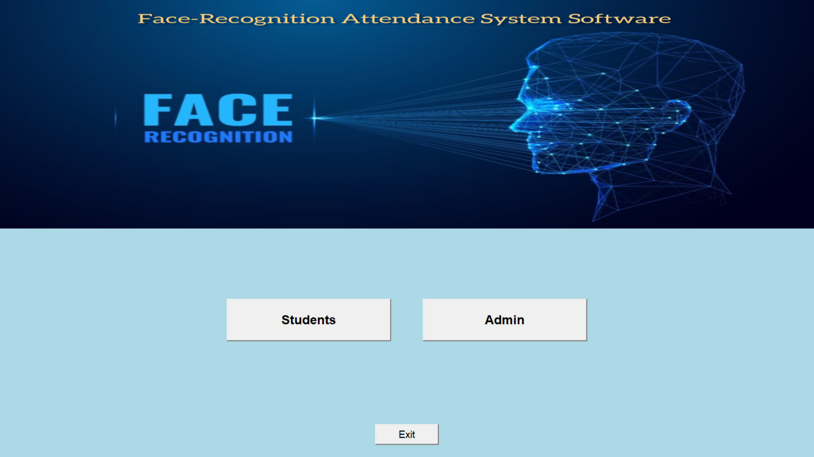
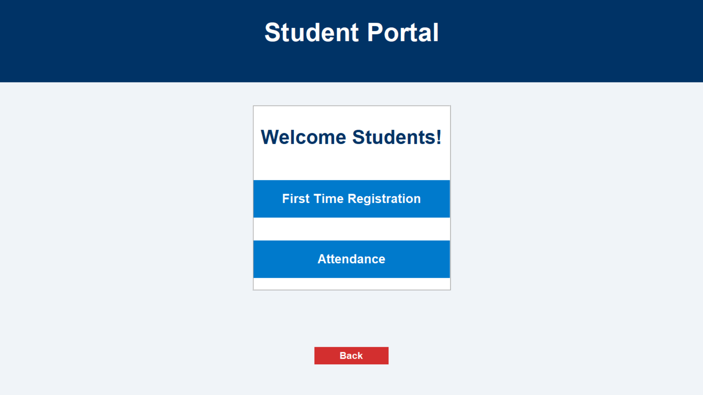
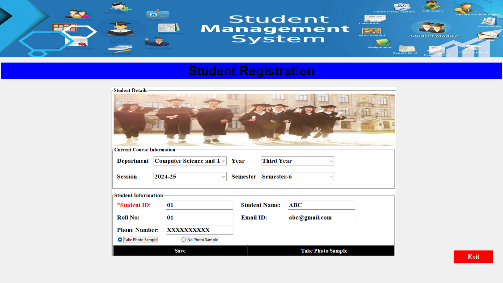
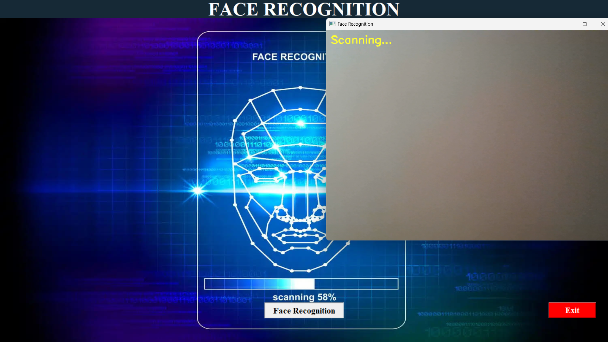
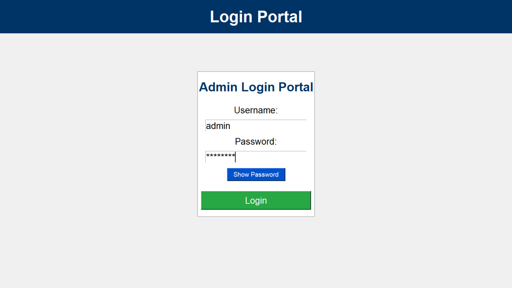
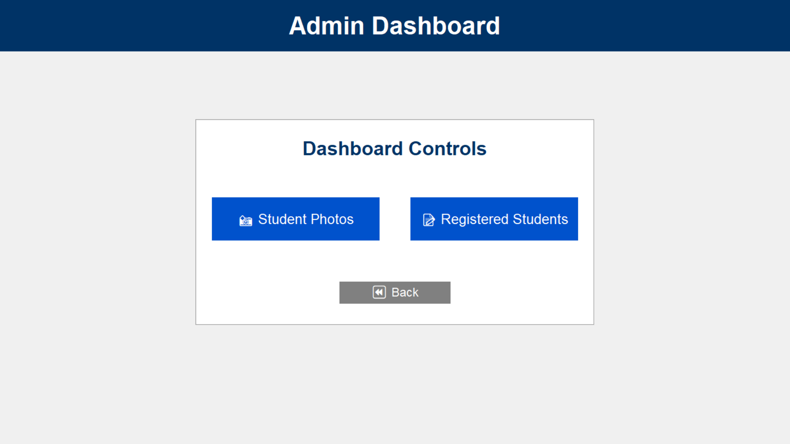
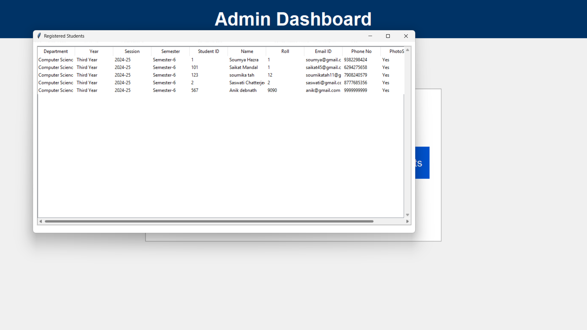

<div align="center">


# 🎯 FaceAttend

### AI-Powered Facial Recognition Attendance Management System

A smart attendance management system that leverages Computer Vision and Facial Recognition to automatically identify students and record attendance in real time.

</div>

---

## 📖 Overview

FaceAttend is a desktop-based attendance management system developed using Python, OpenCV, Tkinter, and MySQL.

The system automates attendance tracking by recognizing students' faces through a webcam, eliminating the need for manual attendance marking and reducing proxy attendance.

---

## ✨ Features

- 👨‍🎓 Student Registration
- 📸 Face Dataset Generation
- 🤖 Face Recognition using OpenCV
- ✅ Automatic Attendance Marking
- 📊 Attendance Records Management
- 🔐 Admin Login System
- 👥 Student Database Management
- ⚡ Real-Time Recognition
- 💾 MySQL Database Integration
- 🖥️ User-Friendly GUI with Tkinter

---

## 🛠️ Tech Stack

### Programming Language
- Python

### GUI Framework
- Tkinter

### Computer Vision
- OpenCV

### Database
- MySQL

### Libraries Used
- NumPy
- Pillow (PIL)
- OpenCV
- MySQL Connector

---

## 📸 Project Screenshots

### 🏠 Main Window


### 👨‍🎓 Student Portal


### 📝 Student Registration Window


### 📋 Attendance Panel


### 🎥 Real-Time Face Recognition & Attendance

The system uses OpenCV and LBPH Face Recognizer to identify students in real time and automatically mark attendance.



### 📊 Attendance Records


### 🔐 Admin Login Portal


### ⚙️ Admin Dashboard


### 👥 Registered Students


---

## 🏗️ Project Structure

```bash
FaceAttend/
│
├── screenshots/
│
├── data/
│
├── admin_login.py
├── app.py
├── attendance.py
├── attendance.csv
├── face_recognition.py
├── face_recognition_op.py
├── student.py
├── student_table.py
│
├── classifier.xml
├── haarcascade_frontalface_default.xml
│
├── requirements.txt
└── README.md
```

---

## ⚙️ Installation

### Clone Repository

```bash
git clone https://github.com/Saswatiiiii/FaceAttend.git
cd FaceAttend
```

### Create Virtual Environment

```bash
python -m venv myenv
```

### Activate Environment

#### Windows

```bash
myenv\Scripts\activate
```

#### Linux / Mac

```bash
source myenv/bin/activate
```

### Install Dependencies

```bash
pip install -r requirements.txt
```

### Run Application

```bash
python app.py
```

---

## 🚀 How It Works

### Step 1: Student Registration
Students enter their details and register in the system.

### Step 2: Dataset Generation
Multiple facial images are captured using the webcam and stored in the dataset.

### Step 3: Model Training
The system trains the facial recognition model using the collected images.

### Step 4: Face Recognition
The webcam scans faces in real time and identifies registered students.

### Step 5: Attendance Marking
Attendance is automatically recorded in the database and attendance file.

### Step 6: Attendance Management
Admins can view attendance records and registered students through the dashboard.

---

## 🎯 Use Cases

- Schools
- Colleges
- Universities
- Coaching Institutes
- Training Centers
- Corporate Attendance Systems

---

## 🔒 Benefits

- Contactless Attendance
- Eliminates Proxy Attendance
- Fast and Accurate Recognition
- Automated Record Keeping
- Easy Student Management
- Time Efficient

---

## 📈 Future Enhancements

- Web-Based Dashboard
- Cloud Database Integration
- Email Notifications
- Attendance Analytics
- Mobile Application
- Multi-Class Management
- Face Mask Detection Support

---

## 👩‍💻 Author

### Saswati Chatterjee

Computer Science & Engineering Student

- 💼 LinkedIn: https://linkedin.com/in/saswati
- 💻 GitHub: https://github.com/Saswatiiiii

---

## ⭐ Support

If you found this project useful, please consider giving it a ⭐ on GitHub.

It helps the project reach more developers and motivates further improvements.

---

<div align="center">

### Thank You for Visiting ❤️

</div>